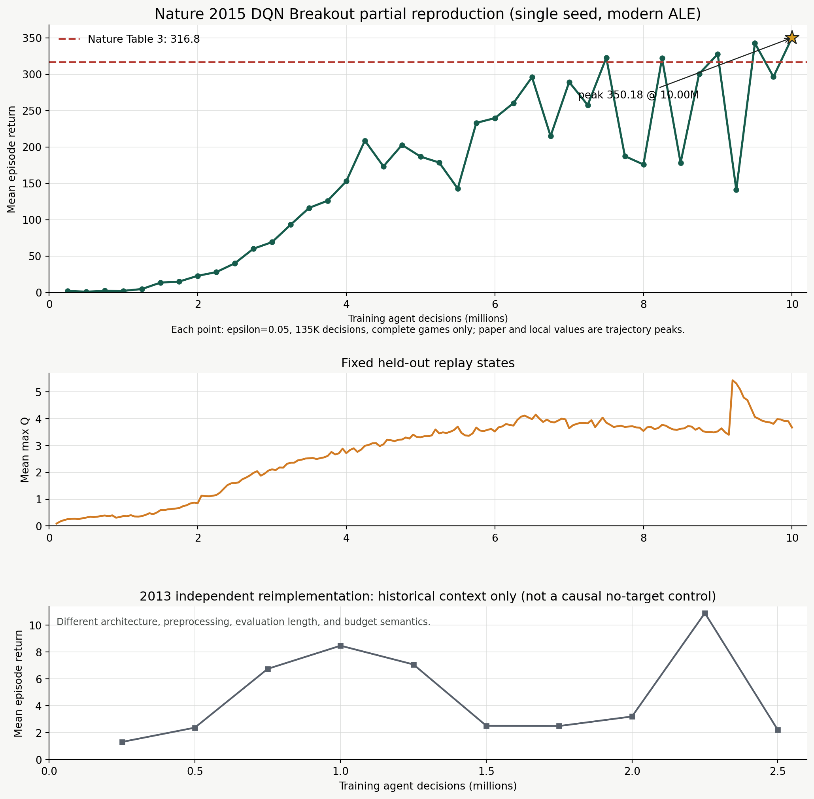

# 从 2013 DQN 到 Nature 2015 DQN：Breakout 方法、实现与复现报告

## 摘要

本项目围绕 Atari Breakout 复现 Deep Q-Network（DQN），目标是先理解 DQN 的价值学习、经验回放和
目标网络，再在现代执行栈中恢复论文结果。项目首先独立实现 2013 arXiv 版本，观察到学习后明显
回退，10M emulator-frame 运行的周期评估峰值为 `10.90`、最终为 `2.21`，未复现论文平均分
`168`。协议审计发现 replay capacity 与 epsilon decay 的 decision/frame 单位是重要稳定性因素，
修正后短程稳定性改善，但继续独立猜测历史实现细节的风险较高。

随后项目转向协议更完整的 Nature 2015 DQN，以 Extended Data Table 3 的 Breakout replay + target
结果 `316.8` 为目标。我们依据论文、DeepMind DQN 3.0 代码语义和 CleanRL 现代工程结构实现独立
PyTorch executor，冻结 10M agent decisions、单训练 seed 和 135K-decision 周期评估协议。正式
运行自然完成，用时 `7.934h`，40 次周期评估最终也是峰值均分 `350.18`；最终 checkpoint 独立
复评 60 局得到相同逐局 return 序列。该结果支持在现代 ALE 独立实现中恢复 Nature 2015 Breakout
的分数量级，但单任务、单 seed、现代 ALE 和固定单一学习率使结论仍为部分数值复现。

## 1. 研究目标与复现范围

### 1.1 目标

本项目回答三个递进问题：

1. DQN 如何把 Q-learning、卷积网络和经验回放结合到像素输入控制？
2. 2013 与 Nature 2015 DQN 在网络、Target Network 和 Atari 协议上有何区别？
3. 在现代 Gymnasium/ALE-Py/PyTorch 执行栈上，能否恢复 Nature 2015 Breakout 的结果量级？

### 1.2 最小论文主张

正式复现绑定 Nature 2015 Extended Data Table 3：Breakout 在 replay + target 条件下的周期评估
最高平均分为 `316.8`。本项目不复现全部 49 个 Atari 游戏，也不执行论文完整 2x2 replay/target
消融矩阵。

### 1.3 复现类型

本项目属于 `independent_reimplementation`：

- 论文是主张与公开协议的事实来源；
- DeepMind DQN 3.0 受限源码只读用于恢复 step/frame 和 optimizer 语义，不复制进公开仓；
- CleanRL MIT 实现提供现代单文件工程结构参考；
- 实际训练由本仓独立 PyTorch executor 完成。

## 2. DQN 方法

### 2.1 从 Bellman 最优方程到 Q-learning

动作价值函数表示在状态 `s` 采取动作 `a` 后，并继续遵循某策略所得折扣回报期望：

\[
Q^\pi(s,a)=\mathbb{E}_\pi\left[\sum_{k=0}^{\infty}\gamma^k r_{t+k+1}\mid s_t=s,a_t=a\right].
\]

最优动作价值满足 Bellman 最优方程：

\[
Q^*(s,a)=\mathbb{E}\left[r+\gamma\max_{a'}Q^*(s',a')\right].
\]

表格 Q-learning 用采样 transition 构造 TD target，并向它更新当前估计。DQN 用参数为
`theta` 的神经网络 `Q_theta(s,a)` 替代表格，使算法能够处理 Atari 像素状态。

### 2.2 DQN 的 TD target

Nature DQN 使用冻结参数 `theta-` 的 Target Network：

\[
y=r+\gamma(1-done)\max_{a'}Q_{\theta^-}(s',a').
\]

在线网络只取 batch 中实际执行动作的预测：

\[
\hat q=Q_\theta(s,a).
\]

本项目实现论文所述的 TD error clipping；它等价于 delta 为 1 的 Huber 目标：小误差区域使用平方
损失，大误差区域保持常数梯度，降低极端 TD target 对一次更新的冲击。

### 2.3 Experience Replay

在线 Atari transition 高度相关。Replay Buffer 保存历史 `(s,a,r,s',done)`，再均匀随机抽取
minibatch，用于：

- 打散连续轨迹相关性；
- 重复利用经验，提高样本效率；
- 让短时间训练分布相对平稳。

Replay 并不会让数据真正独立同分布，也不是直接的泛化保证。本项目使用 capacity 1M、warmup
50K、batch 32，每 4 个 agent decisions 更新一次。

### 2.4 Target Network

若同一网络同时产生预测和立即变化的 target，梯度更新会同时移动拟合对象。Target Network 是
online network 的冻结副本，每 10K agent decisions 硬同步一次，使 target 分段稳定。

Target Network 主要处理时间上的 moving-target 反馈。它不会消除 `max` 的动作选择偏差；Double
DQN 才进一步用 online network 选择动作、target network 评估动作，缓解 maximization bias。

### 2.5 探索、奖励裁剪与评估

训练使用 epsilon-greedy：warmup 内 epsilon 为 1，随后在 1M decisions 内降到 0.1。训练奖励裁剪
到 `{-1,0,1}`，用于统一尺度并约束 TD target；评估仍使用游戏 raw score。因此训练 Q 与完整游戏
raw score 不能直接相减。

## 3. 2013 与 Nature 2015 的区别

| 组件 | 2013 arXiv 路线 | Nature 2015 主线 |
|---|---|---|
| 网络 | Conv 16/32 + FC256 | Conv 32/64/64 + FC512 |
| Bootstrap | 当前 online Q | 延迟 Target Network |
| Replay | uniform replay | uniform replay，协议更完整 |
| Atari 预处理 | 历史细节不完整 | max-over-two、84x84、stack4、repeat4 |
| 训练 terminal | 不使用 life-loss terminal | life loss 作为训练 terminal |
| 评估 | 本地短窗口 | epsilon .05、135K decisions、完整 games |
| 结果 | 峰值 10.90、最终 2.21 | 峰值/最终 350.18 |

这两条路线同时改变网络、预处理、预算和评估，不能被当作 Target Network 单变量消融。

## 4. 代码实现

### 4.1 文件映射

| 方法组件 | 代码入口 |
|---|---|
| Nature 网络、训练循环、评估和 checkpoint | [`src/dqn2015_nature_breakout.py`](../src/dqn2015_nature_breakout.py) |
| JSON config launcher | [`scripts/run_nature2015_config.py`](../scripts/run_nature2015_config.py) |
| Checkpoint 独立复评 | [`scripts/evaluate_dqn2015_checkpoint.py`](../scripts/evaluate_dqn2015_checkpoint.py) |
| Run 完整性验证 | [`scripts/verify_run.py`](../scripts/verify_run.py) |
| 公开结果哈希验证 | [`scripts/verify_reference.py`](../scripts/verify_reference.py) |
| 2013 独立实现 | [`src/dqn2013_breakout.py`](../src/dqn2013_breakout.py) |

### 4.2 网络

输入是 `4 x 84 x 84` uint8 帧堆叠，进入：

```text
Conv2d(4, 32, kernel=8, stride=4) + ReLU
Conv2d(32, 64, kernel=4, stride=2) + ReLU
Conv2d(64, 64, kernel=3, stride=1) + ReLU
Linear(3136, 512) + ReLU
Linear(512, 4)
```

Breakout 四动作网络共有 `1,686,180` 个参数，单元测试锁定输出尺寸和参数量。

### 4.3 一次 minibatch 更新

训练循环可以压缩为：

```text
obs -> epsilon-greedy action -> ALE step -> replay.add

if after warmup and decision % 4 == 0:
    batch = replay.sample(32)
    next_q = target_network(next_obs).max(action)
    target = clipped_reward + 0.99 * next_q * (1 - done)
    predicted = online_network(obs).gather(action)
    loss = clipped_td_error(predicted, target)
    centered_rmsprop.step()

if decision % 10_000 == 0:
    target_network <- online_network
```

Target 计算位于 `torch.no_grad()` 中。训练环境将 life loss 作为 replay terminal；evaluation 环境不
使用 EpisodicLifeEnv 或 ClipRewardEnv，统计真实完整游戏。

### 4.4 优化器

论文和作者代码使用的 centered RMSProp 与 PyTorch 常见默认值不同。本项目独立实现 gradient
moving average、squared-gradient moving average、momentum `0.95` 和根号内 epsilon `0.01`，并用
一步手算测试锁定公式。

### 4.5 可审计输出

运行器在计算前排他创建 `.started`，写出完整 config 和 runtime 版本；训练中记录 JSONL、held-out
Q 和周期 checkpoint；自然完成写 `.completed`。重复输出目录会失败，避免断连或超时造成双进程。

## 5. 复现协议

### 5.1 训练协议

| 字段 | 冻结值 |
|---|---:|
| 环境 | `BreakoutNoFrameskip-v4`, sticky=false |
| Action repeat | 4 |
| 预算 | 10M agent decisions / 40M nominal emulator frames |
| Train seed | 0 |
| Replay | 1M capacity；50K warmup；batch32 |
| Update | 每 4 decisions |
| Target sync | 每 10K decisions |
| Discount | 0.99 |
| Optimizer | centered RMSProp，lr 2.5e-4 |
| Exploration | 1.0 -> 0.1 over 1M post-warmup decisions |
| Checkpoint | 每 250K decisions |

### 5.2 评估协议

- 每 250K training decisions 独立评估；
- epsilon `0.05`；
- 固定 eval seed `10000`；
- 每次 135K agent decisions；
- 不把 life loss 当 terminal；
- 不使用 reward clipping；
- 只统计窗口内完成的真实 games；
- Table 3 对照采用训练轨迹上周期评估 peak。

### 5.3 预算恢复

Nature 论文称完整训练为 50M frames，并约等于 38 天游戏经验。以 60 Hz 计算约为 200M emulator
frames，对应 action repeat 4 下 50M agent decisions。作者代码也以 decision 递增并打印
`frames=step*actrep`。因此 Table 3 的 10M 在本项目冻结为 10M agent decisions，而不是 2.5M。

## 6. 实验过程

### 6.1 工程阶梯

正式训练前依次完成：

1. 环境 reset/step、网络前向和 optimizer known-answer test；
2. 256-decision CPU smoke，检查 replay、update、target sync 和 checkpoint；
3. 受控中断 smoke，检查 SIGTERM checkpoint 与 GPU 释放；
4. 250K-decision pilot，测吞吐、评估成本、磁盘和数值有限性；
5. 10M-decision formal run，不根据 pilot 分数调参。

Pilot 的 post-warmup 吞吐为 `526.96 decisions/s`，保守预测完整运行 `6.98h`，通过不超过 20 小时的
成本门。正式运行实际用时 `7.934h`，主要差异来自 40 次各 135K decisions 的完整评估。

### 6.2 完整性

- 10,000,000 decisions 自然完成；
- 2,487,500 optimizer updates；
- 40/40 evaluator 完成；
- 无 traceback、OOM、NaN 或 Inf；
- final checkpoint 可加载且所有参数有限；
- 公开 reference package 可由 SHA256 重验。

## 7. 结果



| 指标 | 结果 |
|---|---:|
| Nature Table 3 参考 | 316.8 |
| 本地 peak / final mean | 350.1833 |
| 相对论文参考 | +10.54% |
| Final median | 373.5 |
| 评估点数 | 40 |
| 完整 games 总数 | 5,498 |
| 评估点 >=100 / >=200 / >=300 | 27 / 16 / 6 |
| Held-out mean max-Q final / max | 3.671 / 5.434 |

最后五次 mean 为：

```text
327.55, 141.00, 342.54, 296.32, 350.18
```

因此策略已经进入论文分数量级，但末段仍有明显周期波动。不能只展示 peak 而隐藏完整曲线。

### 7.1 独立 checkpoint 复评

final checkpoint SHA256：

```text
73e3e71f437bf07f59128b712f8a7e294c23052b9d6d5c62cb2478b58d672ef0
```

从该 checkpoint 独立运行同一冻结评估协议，得到 60 个完整 games、mean `350.1833`、median
`373.5`；逐 episode return 序列与原 final evaluator 完全一致，mean difference 为 `0.0`。

## 8. 结果解释

### 8.1 可以支持的结论

在 Nature 网络、replay、Target Network、centered RMSProp、Huber/clipped TD、reward clipping、
探索和评估预算均冻结的条件下，本地策略由接近随机逐步进入 100、200、300 分量级，并在论文
Table 3 的 trajectory-peak 口径下达到 `350.18`。这支持 Nature 2015 DQN 的 Breakout 结果量级
可以在当前现代独立实现中部分复现。

### 8.2 不能支持的结论

- 一个 seed 不能估计跨 seed 稳定性；
- 本地 350.18 与论文 316.8 不是统计等价证明；
- 论文从三个学习率中选取有利结果，本地只固定 2.5e-4；
- 现代 ALE/PyTorch 与 Lua/Torch7/Xitari 原栈不等价；
- 历史 2013 EXP-0001 不是配对 no-target 消融；
- 本结果不是 Table 2 的 50M-decision `401.2 +/- 26.9` 复现。

因此正式裁决保持 `promising_unresolved`，而不是完整复现。

## 9. 2013 路线的结果与教训

2013 独立实现只使用两层卷积、FC256 和 online Q bootstrap。10M emulator frames 后评估峰值
`10.90`、最终 `2.21`，说明产生了学习但出现明显回退，远低于论文平均 `168`。

后续诊断发现本地 replay capacity 和 epsilon decay 被按较短的 agent-step 单位消费。联合修正为
1M decisions 后，在 1.5M-decision 配对窗口中：

- Q mean max 从 `61.74` 降至 `3.72`；
- loss max 从 `25.40` 降至 `0.242`；
- 终点评估从 `2.51` 提升到 `10.04`。

这支持单位缩短是首次失稳的重要促成因素，但联合变量、短预算和单 seed 不能形成论文数值复现或
Target Network 因果结论。该路线的主要价值是揭示老论文复现中 frame/decision/update 语义的重要性。

## 10. 局部机制扩展

正式结果跑通后，我们复用 40 个 checkpoint 和固定状态，检查 Q、action margin、FC512 表征和视觉
扰动。9.25M checkpoint 的 mean return 降至 `141.00`，fixed-state mean max-Q 却升至 `5.315`；
action margin 和 FC512 对齐同时回撤。

进一步使用 Greydanus Gaussian-blur 方法检验“9.25M 更广泛视觉脆弱”的假说。该阶段的视觉扰动
幅度反而更低、空间响应更集中，local action-switch 未显著增加。因此 broad visual fragility 假说
在当前固定状态干预下被否定。

这项扩展只支持局部共现和对一个解释的排除，不证明 maximization bias、低 margin 或表征回撤导致
回报低谷。Q-return calibration 仍为 unknown。完整材料见项目的 `ART-0033` showcase bundle。

## 11. 可复现性设计

公开仓库提供四级验证：

```bash
./scripts/reproduce.sh test
./scripts/reproduce.sh smoke
./scripts/reproduce.sh verify-reference
./scripts/reproduce.sh eval <checkpoint>
./scripts/reproduce.sh full
```

- `test` 检查公式和代码契约；
- `smoke` 在 CPU 上完成训练全链路；
- `verify-reference` 检查公开证据哈希与 headline 数值；
- `eval` 验证 Release checkpoint；
- `full` 从头重跑 10M decisions。

GitHub Actions 在 CPU runner 上安装 ROM 后执行 unit tests、reference verification 和 smoke。公开结果
包包含曲线、40 点 CSV、summary、独立复评和 source manifest；final checkpoint 作为 GitHub Release
asset 单独发布，ROM 不进入仓库。

## 12. 结论

本项目完成了从 DQN 方法理解、2013 独立实现诊断，到 Nature 2015 协议恢复和 Breakout 单 seed
数值复现的闭环。最重要的结果不是本地分数略高于论文参考，而是完整恢复了预算、网络、优化、
Target Network 和评估语义，并让第三方可以从测试、smoke、checkpoint 复评和完整训练四个层级
独立验证。

当前证据支持“现代 ALE 独立实现恢复了 Nature 2015 Breakout Table 3 分数量级”，不支持完整论文
复现或跨 seed 稳定性。若未来需要提升证据等级，最直接的下一步是在相同公开协议下增加预注册训练
seed，而不是继续围绕单 seed 曲线形状调参。

## 参考文献

1. Mnih, V. et al. *Playing Atari with Deep Reinforcement Learning*. arXiv:1312.5602, 2013.
2. Mnih, V. et al. *Human-level control through deep reinforcement learning*. Nature 518, 529--533, 2015.
3. van Hasselt, H., Guez, A., Silver, D. *Deep Reinforcement Learning with Double Q-learning*. AAAI, 2016.
4. Greydanus, S. et al. *Visualizing and Understanding Atari Agents*. ICML, 2018.

## 附录：证据与版本

- Nature PDF SHA256：`cc811007a48aea14fcc135158ed96d01982930f415045a19f89474bfa1a74eb5`
- EXP-0004 training commit：`d1234d94c106c87d61c6baa3a090a38802a7df76`
- DeepMind DQN oracle：`9d9b1d13a2b491d6ebd4d046740c511c662bbe0f`
- CleanRL reference：`fe8d8a03c41a7ef5b523e2e354bd01c363e786bb`
- Public result manifest：[`assets/EXP-0004/manifest.json`](assets/EXP-0004/manifest.json)
- 完整协议审计：[`../references/NATURE2015_PROTOCOL_AUDIT.md`](../references/NATURE2015_PROTOCOL_AUDIT.md)

